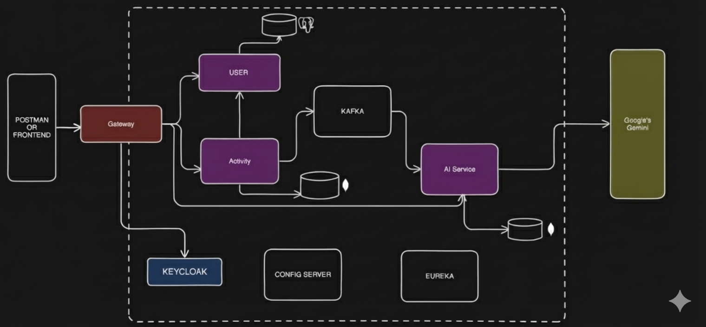

# 🏋️‍♂️ AI-Powered Fitness Tracker  
### Microservices Architecture • Spring Boot • Keycloak • Kafka • Docker • Render • Netlify  

A distributed **microservices-based fitness tracking platform** with **AI-generated workout recommendations** using **Google Gemini**.  
The platform uses **Keycloak authentication**, **Kafka (Redpanda)** for async communication, **Spring Cloud** for configuration + discovery, and cloud deployment on **Render + Netlify**.

## 🧱 Architecture Overview




Additionally:

| Component | Purpose |
|----------|---------|
| **Config Server** | Centralized config for all services |
| **Eureka Server** | Service registry & discovery |
| **Render** | Cloud hosting for backend |
| **Netlify** | Hosts frontend |
| **Docker** | Local development |

---

# 🌐 Live URLs

| Service | URL |
|--------|-----|
| **Frontend** | https://ai-powered-fitness.netlify.app |
| **API Gateway** | https://gateway-server-7ywl.onrender.com |
| **User Service** | https://user-server-vdzw.onrender.com |
| **Activity Service** | https://activity-server-a4v4.onrender.com |
| **AI Service** | https://ai-server-9f5p.onrender.com |
| **Eureka Server** | https://eureka-server-6mb3.onrender.com |
| **Config Server** | https://config-server-nrac.onrender.com |
| **Keycloak** | https://keycloak-server-8qaj.onrender.com |

_(replace placeholder URLs in your repo before publishing)_

---

# 🔐 Authentication — Keycloak Setup

### 1️⃣ Create Realm
Realm name: fitness-app


### 2️⃣ Create Client

Client ID: oauth2-pkce-client

Client Protocol: OpenID Connect

Client Access Type: Public

### Valid Redirect URIs

https://ai-powered-fitness.netlify.app/

### Web Origins

https://ai-powered-fitness.netlify.app


### Enable These:
✔ Standard Flow  
✔ Direct Access Grants  
❌ Implicit Flow  

---

# 🧩 Microservice Ports

| Service | Port | Description |
|---------|------|-------------|
| Config Server | 8888 | Central app configs |
| Eureka Server | 8761 | Microservice registration |
| API Gateway | 8080 | Entry point for frontend |
| User Service | 8081 | Manages users (NeonDB) |
| Activity Service | 8082 | Activity data (MongoDB Atlas) |
| AI Service | 8083 | Uses Gemini to generate recommendations |
| Keycloak | 8181 | Authentication server |

---

# ⚙️ Common `bootstrap.yml` (used by all services)

```yaml
spring:
  application:
    name: service-name

  cloud:
    config:
      uri: https://config-server-xxxx.onrender.com
      fail-fast: false

eureka:
  client:
    serviceUrl:
      defaultZone: https://eureka-server-xxxx.onrender.com/eureka
```
## 🔌 Environment Variables (Render)

Gateway
```yaml
SERVER_PORT=8080
SPRING_CONFIG_IMPORT=optional:configserver:https://config-server-XXXX.onrender.com
EUREKA_CLIENT_SERVICEURL_DEFAULTZONE=https://eureka-server-XXXX.onrender.com/eureka
SPRING_SECURITY_OAUTH2_RESOURCESERVER_JWT_JWK_SET_URI=https://keycloak-server-XXXX.onrender.com/realms/fitness-app/protocol/openid-connect/certs
```

User Service
```yaml
SPRING_DATASOURCE_URL=jdbc:postgresql://<neon-url>/<db>
SPRING_DATASOURCE_USERNAME=<user>
SPRING_DATASOURCE_PASSWORD=<pass>
SPRING_CONFIG_IMPORT=https://config-server-XXXX.onrender.com
```
Activity Service
```yaml
MONGO_USERNAME=<atlas-user>
MONGO_PASSWORD=<atlas-pass>
SPRING_CONFIG_IMPORT=https://config-server-XXXX.onrender.com
```

AI Service
```yaml
GEMINI_KEY=<your-key>
KAFKA_BOOTSTRAP=<redpanda-bootstrap-server>
KAFKA_USERNAME=<rp-user>
KAFKA_PASSWORD=<rp-password>
SPRING_CONFIG_IMPORT=https://config-server-XXXX.onrender.com
```

##🌩 Deploying Backend (Render)

For each microservice:

1. Click New Web Service

2. Select its folder from your GitHub repo

3. Runtime = Docker

4. Add environment variables

5. Deploy

## 🕸 Deploying Frontend (Netlify)

In Netlify Environment Variables:
```yaml

VITE_API_BASE_URL=https://gateway-server-XXXX.onrender.com
```

Build Command:
```yaml

npm run build
```
Publish Directory:
```yaml

dist
```
## 🤖 AI Service — Google Gemini API

Used for generating workout advice:
```yaml
POST https://generativelanguage.googleapis.com/v1beta/models/gemini-pro:generateContent?key=API_KEY
```

## 🐳 Local Development — Docker

docker-compose.yml (example)
```yaml
version: "3.8"

services:
  config-server:
    build: ./configserver
    ports:
      - "8888:8888"

  eureka-server:
    build: ./eureka
    ports:
      - "8761:8761"

  gateway-service:
    build: ./gateway
    ports:
      - "8080:8080"
```
Run locally:
```yaml
docker compose up --build
```
## 🧪 System Flow

1. User logs in → Keycloak handles authentication

2. Keycloak redirects back to frontend with token

3. Frontend sends token to Gateway

4. Gateway routes to individual microservices

5. Activity service sends event → Kafka

6. AI service consumes Kafka event → generates recommendation

7. User sees personalized workout suggestion

## 🎉 Credits

Made with ❤️ using:

. Spring Boot

. Spring Cloud

. Keycloak

. Kafka (Redpanda)

. Google Gemini

. Docker

. Render

. Netlify
